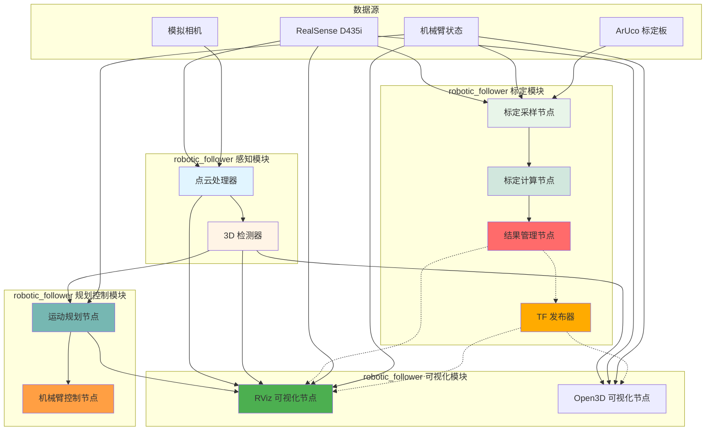

# Robotic_Follower 系统架构设计

**版本**: 1.0
**日期**: 2026-03-20
**作者**: Claude AI

---

## 概述

Robotic_Follower 是一个基于 ROS2 Humble 的机械臂视觉跟随系统，采用模块化架构设计，
将功能划分为感知为标定、规划控制和可视化四个独立模块。

本系统遵循以下设计原则：
- **单一职责原则 (SRP)**: 每个节点只负责一个明确的功能
- **开闭原则 (OCP)**: 模块可扩展，支持新的传感器/算法
- **依赖倒置原则 (DIP)**: 高层模块不依赖低层实现细节
- **接口隔离原则 (ISP)**: 使用标准 ROS2 消息/服务接口

---

## 系统架构图



---

## 模块职责划分

| 模块             | 包含节点                                                         | 核心职责            | 输入话题                | 输出话题/服务   |
| ---------------- | ---------------------------------------------------------------- | ------------------- | ----------------------- | --------------- |
| **感知模块**     | RealSenseNode, CameraSimNode, PointCloudProcessor, DetectionNode | 数据采集 + 感知算法 | RGB/深度图              | 点云 + 检测结果 |
| **标定模块**     | Sampler, Calculator, ResultManager, TFPublisher                  | 手眼标定完整流程    | 机器人位姿 + ArUco 检测 | 标定结果 + TF   |
| **规划控制模块** | PlanningNode, ArmControlNode                                     | 运动规划 + 执行     | 检测结果                | 运动指令        |
| **可视化模块**   | RVizVisualizer, Open3DVisualizer                                 | 3D/2D 可视化        | 点云 + 检测             | 可视化标记      |

---

## 话题汇总

> 完整话题定义表（按模块分类）。详细消息类型和字段说明请参考各话题规范。

### 感知相关话题

| 话题名称                                   | 消息类型                       | 发布者                    | 订阅者                 |
| ------------------------------------------ | ------------------------------ | ------------------------- | ---------------------- |
| `/camera/color/image_raw`                  | `sensor_msgs/Image`            | RealSenseNode             | Sampler, RViz, Open3D  |
| `/camera/depth/image_raw`                  | `sensor_msgs/Image`            | RealSenseNode             | -                      |
| `/camera/aligned_depth_to_color/image_raw` | `sensor_msgs/Image`            | RealSenseNode             | PointCloudProc, RViz   |
| `/camera/color/camera_info`                | `sensor_msgs/CameraInfo`       | RealSenseNode             | PointCloudProc, Open3D |
| `/camera/camera/depth/color/points`        | `sensor_msgs/PointCloud2`      | PointCloudProc, CameraSim | RViz, Open3D           |
| `/perception/detections`                   | `vision_msgs/Detection3DArray` | DetectionNode             | RViz, Open3D, Planning |

### 标定相关话题

| 话题名称                                   | 消息类型                             | 发布者     | 订阅者               |
| ------------------------------------------ | ------------------------------------ | ---------- | -------------------- |
| `/robot/pose`                              | `geometry_msgs/PoseStamped`          | 机械臂驱动 | Sampler              |
| `/aruco_markers`                           | `ros2_aruco_interfaces/ArucoMarkers` | ArUco 检测 | Sampler              |
| `/hand_eye_calibration/calibration_sample` | `std_msgs/String` (JSON)             | Sampler    | Calculator           |
| `/hand_eye_calibration/calibration_result` | `std_msgs/String` (JSON)             | Calculator | ResultManager, TFPub |

### 机器人控制相关话题

| 话题名称                  | 消息类型                          | 发布者       | 订阅者                |
| ------------------------- | --------------------------------- | ------------ | --------------------- |
| `/joint_states`           | `sensor_msgs/JointState`          | 机械臂驱动   | robot_state_publisher |
| `/motion_plan/trajectory` | `trajectory_msgs/JointTrajectory` | PlanningNode | ArmControl            |

### 可视化相关话题

| 话题名称                         | 消息类型                         | 发布者 | 订阅者 |
| -------------------------------- | -------------------------------- | ------ | ------ |
| `/perception/pointcloud_display` | `sensor_msgs/PointCloud2`        | RViz   | RViz   |
| `/perception/detection_markers`  | `visualization_msgs/MarkerArray` | RViz   | RViz   |
| `/perception/depth_colored`      | `sensor_msgs/Image`              | RViz   | RViz   |
| `/perception/rgb_display`        | `sensor_msgs/Image`              | RViz   | RViz   |

---

## TF 变换系统

| 父坐标系      | 子坐标系                     | 发布者                     | 频率 | 类型 | 说明                 |
| ------------- | ---------------------------- | -------------------------- | ---- | ---- | -------------------- |
| `world`       | `base_link`                  | static_transform_publisher | -    | 静态 | 机器人基座位置       |
| `camera_link` | `camera_color_optical_frame` | realsense2_camera          | -    | 静态 | RGB 相机内部变换     |
| `camera_link` | `camera_depth_optical_frame` | realsense2_camera          | -    | 静态 | 深度相机内部变换     |
| `base_link`   | `link6_1_1`                  | robot_state_publisher      | 30Hz | 动态 | 机械臂关节状态       |
| `link6_1_1`   | `camera_link`                | TFPublisherNode            | 10Hz | 动态 | 手眼变换（标定结果） |

### TF 树结构

```
world (世界坐标系)
  └─ base_link (机器人基座，静态)
      └─ link1_1_1 ─ link2_1_1 ─ link3_1_1 ─ link4_1_1 ─ link5_1_1 ─ link6_1_1 (末端执行器，动态)
          └─ camera_link (相机安装位置，动态 TF - 手眼变换)
              ├─ camera_color_optical_frame (RGB 相机光学坐标系，静态)
              └─ camera_depth_optical_frame (深度相机光学坐标系，静态)
```

---

## ROS 参数系统

### 标定参数（由 ResultManagerNode 发布）

| 参数名                               | 类型                             | 说明             | 示例值                                                                                 |
| ------------------------------------ | -------------------------------- | ---------------- | -------------------------------------------------------------------------------------- |
| `/hand_eye_calibration/transform`    | `geometry_msgs/TransformStamped` | 手眼变换         | `{translation: {x: 0.1, y: 0.0, z: 0.05}, rotation: {x: 0.0, y: 0.0, z: 0.0, w: 1.0}}` |
| `/hand_eye_calibration/error`        | `float64`                        | 重投影误差（米） | `0.005`                                                                                |
| `/hand_eye_calibration/status`       | `string`                         | 标定状态         | `"calibrated"`, `"collecting"`, `"idle"`                                               |
| `/hand_eye_calibration/sample_count` | `int32`                          | 已收集样本数     | `25`                                                                                   |

### 检测参数（由 DetectionNode 发布）

| 参数名                            | 类型      | 说明                   |
| --------------------------------- | --------- | ---------------------- |
| `/perception/detection_count`     | `int32`   | 当前帧检测到的目标数量 |
| `/perception/last_detection_time` | `float64` | 最后一次检测的时间戳   |

---

## 话题汇总

### 感知相关话题

| 话题名称                                   | 消息类型                       | 发布者                    | 订阅者                 | 说明                 |
| ------------------------------------------ | ------------------------------ | ------------------------- | ---------------------- | -------------------- |
| `/camera/color/image_raw`                  | `sensor_msgs/Image`            | RealSenseNode             | Sampler, RViz, Open3D  | RGB 彩色图像         |
| `/camera/depth/image_raw`                  | `sensor_msgs/Image`            | RealSenseNode             | -                      | 原始深度图           |
| `/camera/aligned_depth_to_color/image_raw` | `sensor_msgs/Image`            | RealSenseNode             | PointCloudProc, RViz   | 对齐到彩色图的深度图 |
| `/camera/color/camera_info`                | `sensor_msgs/CameraInfo`       | RealSenseNode             | PointCloudProc, Open3D | 相机内参信息         |
| `/camera/camera/depth/color/points`        | `sensor_msgs/PointCloud2`      | PointCloudProc, CameraSim | RViz, Open3D           | 处理后的点云         |
| `/perception/detections`                   | `vision_msgs/Detection3DArray` | DetectionNode             | RViz, Open3D, Planning | 3D 目标检测结果      |

### 标定相关话题

| 话题名称                                   | 消息类型                             | 发布者     | 订阅者               | 说明                 |
| ------------------------------------------ | ------------------------------------ | ---------- | -------------------- | -------------------- |
| `/robot/pose`                              | `geometry_msgs/PoseStamped`          | 机械臂驱动 | Sampler              | 机器人末端执行器位姿 |
| `/aruco_markers`                           | `ros2_aruco_interfaces/ArucoMarkers` | ArUco 检测 | Sampler              | ArUco 标定板位姿     |
| `/hand_eye_calibration/calibration_sample` | `std_msgs/String` (JSON)             | Sampler    | Calculator           | 标定样本数据         |
| `/hand_eye_calibration/calibration_result` | `std_msgs/String` (JSON)             | Calculator | ResultManager, TFPub | 标定计算结果         |

### 机器人控制相关话题

| 话题名称                  | 消息类型                          | 发布者       | 订阅者                | 说明           |
| ------------------------- | --------------------------------- | ------------ | --------------------- | -------------- |
| `/joint_states`           | `sensor_msgs/JointState`          | 机械臂驱动   | robot_state_publisher | 机器人关节状态 |
| `/motion_plan/trajectory` | `trajectory_msgs/JointTrajectory` | PlanningNode | ArmControl            | 运动轨迹       |

### 可视化相关话题

| 话题名称                         | 消息类型                         | 发布者 | 订阅者 | 说明            |
| -------------------------------- | -------------------------------- | ------ | ------ | --------------- |
| `/perception/pointcloud_display` | `sensor_msgs/PointCloud2`        | RViz   | RViz   | RViz 显示的点云 |
| `/perception/detection_markers`  | `visualization_msgs/MarkerArray` | RViz   | RViz   | 3D 检测框和标签 |
| `/perception/depth_colored`      | `sensor_msgs/Image`              | RViz   | RViz   | 伪彩色深度图    |
| `/perception/rgb_display`        | `sensor_msgs/Image`              | RViz   | RViz   | RGB 图像显示    |

---

## 包结构

```
robotic_follower/
├── robotic_follower/
│   ├── calibration/              # 标定算法模块
│   │   ├── __init__.py
│   │   ├── calibration_manager.py      # 通用：标定流程管理
│   │   ├── extrinsic_calibrator.py     # 通用：OpenCV 标定算法
│   │   ├── calibration_validator.py     # 通用：结果验证
│   │   └── camera/                  # 专用：标定板检测
│   │       ├── __init__.py
│   │       ├── board_detector.py
│   │       └── aruco_detector.py
│   │
│   ├── point_cloud/             # 点云处理模块
│   │   ├── __init__.py
│   │   ├── io/                     # 通用：I/O 转换
│   │   │   ├── __init__.py
│   │   │   ├── converters.py
│   │   │   ├── ros_converters.py
│   │   │   ├── sunrgbd_io.py
│   │   │   └── projection.py
│   │   ├── filters/                 # 通用：滤波器
│   │   │   ├── __init__.py
│   │   │   └── filters.py
│   │   └── features/                # 专用：特征提取
│   │       ├── __init__.py
│   │       └── density.py
│   │
│   ├── detection/               # 3D 检测模块
│   │   ├── __init__.py
│   │   ├── inference/              # 通用：推理接口
│   │   │   ├── __init__.py
│   │   │   └── detector.py
│   │   └── models/                # 专用：模型实现
│   │       ├── __init__.py
│   │       └── votenet.py
│   │
│   ├── robot/                  # 机器人接口
│   │   ├── __init__.py
│   │   ├── robot_interface.py        # 通用：机器人接口抽象
│   │   └── moveit_interface.py        # 专用：MoveIt2 实现
│   │
│   ├── ros_nodes/              # ROS2 节点
│   │   ├── __init__.py
│   │   │
│   │   ├── calibration/      # 标定节点
│   │   │   ├── __init__.py
│   │ │   ├── sampler_node.py
│   │   │   ├── calculator_node.py
│   │   │   ├── result_manager_node.py
│   │   │   └── tf_publisher_node.py
│   │   │
│   │   ├── perception/        # 感知节点
│   │   │   ├── __init__.py
│   │   │   ├── camera_rs_node.py
│   │   │   ├── camera_sim_node.py
│   │   │   ├── pointcloud_processor.py
│   │   │   └── detection_node.py
│   │   │
│   │   ├── robot/            # 机器人节点
│   │   │   ├── __init__.py
│   │   │   ├── control_node.py
│   │   │   └── planning_node.py
│   │   │
│   │   └── visualization/    # 可视化节点
│   │       ├── __init__.py
│   │       └── rviz_visualizer_node.py
│   │
│   ├── srv/                    # 自定义服务定义
│   │   ├── MoveToPose.srv
│   │   ├── MoveJoints.srv
│   │   └── GetStatus.srv
│   │
│   └── __init__.py
│
├── config/                  # 配置文件
│   ├── votenet_config.yaml
│   ├── calibration_config.yaml
│   └── robot_config.yaml
│
├── launch/                  # 启动文件
│   ├── calibration_full.launch.py
│   ├── perception_real.launch.py
│   ├── perception_sim.launch.py
│   ├── arm_simulation.launch.py
│   ├── visual_follow_demo.launch.py
│   ├── test_pointcloud.launch.py
│   └── test_detection.launch.py
│
├── test/                    # 单元测试
│   └── test_nodes.py

├── setup.py
├── package.xml
└── README.md
```

---

## 设计决策记录

| 决策项         | 选择方案                             | 理由                       |
| -------------- | ------------------------------------ | -------------------------- |
| **消息类型**   | 使用标准消息 + JSON 序列化           | 降低维护成本，复用社区方案 |
| **服务接口**   | 优先使用标准服务（Trigger、SetBool） | 语义清晰，减少自定义定义   |
| **包组织**     | 统一包 robotic_follower              | 避免包碎片化，便于管理     |
| **算法组织**   | 专用算法放模块内，通用算法独立       | 提高代码复用，降低耦合     |
| **可视化方式** | 同时支持 RViz2 和 Open3D             | 满足不同场景需求           |
